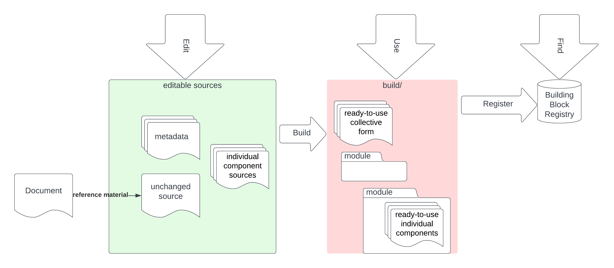

# OGC Building Blocks for SOSA 


The SOSA ([Sensor, Observation, Sample, and Actuator](https://www.w3.org/TR/vocab-ssn/)) ontology  is a realisation of the 
 Observations, Measurements and Sampling (OMS) Conceptual model. This repository defines:
 *  JSON schema encoding for each feature type (class) defined by SOSA, compatible with the OGC API Features using the FG-JSON extension to GeoJSON
 * JSON-LD contexts for each class to link schema elements to relevant class and properties defined by SOSA
 * examples that can be used in documentation
 * validation resources  for this schema and the JSON-LD RDF binding

 This encoding is defined using the [OGC Building Blocks](https://opengeospatial.github.io/bblocks) template, and hence can be combined with other Building Blocks to implement more complete domain models with interoperable encodings and extensible APIs.

## Status and Compatibility

This building block is __under construction__ and is undertaken in the context of the update of SOSA to align with OMS V3.

It is assumed that this will be backwards compatible with the last published SOSA version https://www.w3.org/TR/2017/REC-vocab-ssn-20171019/. Any changes to this status will be noted in this section.

## Documentation

This building block self-documents using the build process described below.  For each component building block in this repository the
deployed documentation is built on commit and can be found here: 

https://opengeospatial.github.io/ogcapi-sosa/build/generateddocs/slate-build/unstable/sosa/features/observation

(TODO - create index in Slate)

## General Building block repository structure


The `build/` directory contains the **_reusable assets_** for implementing this building block, in full or part, and the rest of the repository contain *sources* to build these assets.  *Sources* minimise redundant information and preserve original forms of inputs, such as externally published schemas etc.  This allow these to be updated safely, and also allows for alternative forms of original source material to be used whilst preserving uniformity of the reusable assets.




*  The `build/` directory should never be edited
*  Only resources in the `build/` directory should be used by applications

### Ready to use components

- `build/`: the available versions of the building block ready for reuse

Note that the these components will be consistently structured for a given type of building block, and the editable components may vary according to the source material used to derive the building block, and therefore cannot be directly referenced.

### Editable components

- `features/`: schemas for the feature types defined by this bb (which is a "super-bb" containing at least oneOf these defined features)
- `datatypes/`: reusable schemas for (potentially complex) datatypes defined by this bb
- `aspects/`: groups of properties that may be included in feature types (equivalent to attribute groups in XML schema)
- `assets/`: Documentation assets (e.g. images) directory. See [Assets](#assets) below.


### Individual building block structure

After building each of the building blocks (including any top-level composite building block) contains the following files:

- `bblock.json`: Contains the metadata for the building block. 
- `description.md`: Human-readable, Markdown document with the description of this building block.
- `examples.yaml`: A list of examples for this building block. See [Examples](#examples) below.
- `schema.yaml`: JSON schema using YAML syntax for this building block, if any. See [JSON schema](#json-schema) below.
- `schema.json`: equivalent JSON schema using JSON syntax. 

Note: some these files may not be present in the **source* - for example a description could be extracted from the model referenced in the schema or bblock.json metadata.

Note: the top level building block schemas may be generated from the components automatically.


## Building Block identifiers

These are automatically generated in the form:

```
<identifier-prefix><bb-path>
```

where:

- `identifier-prefix` is read from `bblocks-config.yaml`. This will initially be a placeholder value,
  but should have an official value eventually (see [How-to](#how-to)).
- `bb-path` is the dot-separated path to the building block inside the repository.
 
## Examples

Each example consists of Markdown `content` and/or a list of `snippets`. `snippets`, in turn,
have a `language` (for highlighting, language tabs in Slate, etc.) and the `code` itself. 

Each class supported by this building block has an
`examples.yaml` file.  (`examples.json` may be used as an alternative.)


## Postprocessing overview

*TBD: this section to be automatically inserted from the template.*

This repository comes with a GitHub workflow that detects, validates and processes its building blocks,
so that their outputs can be tested before inclusion in the main OGC Register:


### Output testing

The outputs can be generated locally by running the following:

```shell
# Process building blocks
docker run --rm --workdir /workspace -v $(pwd):/workspace ghcr.io/opengeospatial/bblocks-postprocess \
  --clean true --base-url https://example.com/base-url/
# Optional - build Slate docs
docker run --rm -v "$(pwd)/build/docs/slate:/srv/slate/source" \
  -v "$(pwd)/build/docs/slate-build:/srv/slate/build" slatedocs/slate build
```

**Notes**:
  * Docker must be installed locally for the above commands to run
  * The value for `--base-url` will be used to generate the public URLs (schemas, documentation, etc.)
  * If you want to clean your build (go back to the original repository status), you can do so by running
    `git checkout build; git clean -xf build` 
